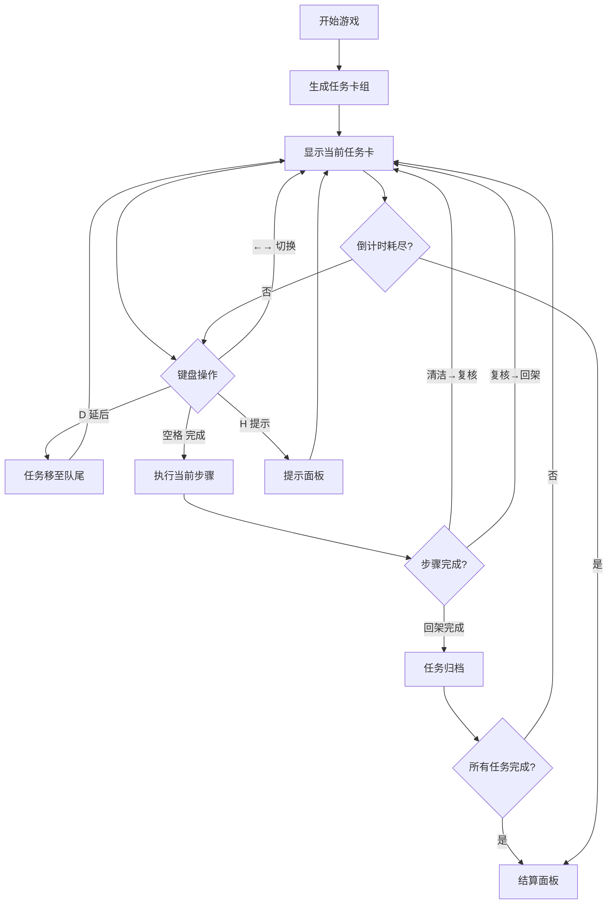

## 1. 产品概述

诊室器材整理模拟游戏——玩家在限定时间内对诊室器材执行清洁、复核、回架三项操作，通过键盘快捷键高效完成任务，同时拖动风险阈值预警线在速度与安全之间取得平衡。

- 目标用户：医疗培训学员、医院实习生、护理专业学生
- 核心价值：通过游戏化方式训练器材处理流程的规范意识与时间管理能力

## 2. 核心功能

### 2.1 用户角色

| 角色 | 注册方式 | 核心权限 |
|------|----------|----------|
| 玩家 | 直接进入 | 操作任务、调整阈值、查看提示 |
| 观察者 | 只读模式 | 查看提示面板风险、查看结算面板得分 |

### 2.2 功能模块

1. **游戏主界面**：任务卡区域、倒计时条、快捷键提示栏、阈值滑块
2. **提示面板**：风险等级展示、预警信息
3. **结算面板**：得分统计、历史记录、导出功能

### 2.3 页面详情

| 页面名称 | 模块名称 | 功能描述 |
|----------|----------|----------|
| 游戏主界面 | 任务卡区域 | 显示当前待处理器材任务卡，支持清洁/复核/回架三种操作 |
| 游戏主界面 | 倒计时条 | 顶部横向倒计时进度条，时间耗尽游戏结束 |
| 游戏主界面 | 快捷键提示栏 | 底部常驻快捷键提示：←→ 切换、D 延后、空格 完成、H 查看提示 |
| 游戏主界面 | 阈值滑块 | 可拖动的风险阈值预警线，影响安全评分计算 |
| 提示面板 | 风险展示 | 仅显示当前任务的风险等级和预警信息，只读 |
| 结算面板 | 得分统计 | 展示速度分、安全分、总分，只读 |
| 结算面板 | 历史记录 | localStorage 保存的历史成绩列表 |
| 结算面板 | 导出功能 | 导出成绩为 JSON 文件下载 |

## 3. 核心流程

玩家进入游戏后，系统随机生成一批诊室器材任务卡，每张任务卡包含器材名称、污染等级、操作步骤（清洁→复核→回架）。玩家通过键盘快捷键切换当前任务卡、延后处理、完成当前步骤。倒计时条持续递减，时间耗尽自动进入结算。玩家可拖动风险阈值预警线，阈值越高越安全但速度评分越低，阈值越低速度评分高但安全风险增大。完成后进入结算面板展示各项得分。

## 4. 用户界面设计

### 4.1 设计风格

- 主色调：深青色 (#0D7377) + 暖橙色 (#FF6B35) 强调色
- 辅助色：浅灰底 (#F0F4F8)、白色卡片、红色预警 (#E63946)
- 按钮风格：圆角矩形，hover 时轻微上浮阴影
- 字体：标题使用 Noto Sans SC Bold，正文使用 Noto Sans SC Regular
- 布局：居中卡片布局，顶部倒计时条，底部快捷键栏
- 图标：使用文字符号和简单几何形状标识风险等级

### 4.2 页面设计概览

| 页面名称 | 模块名称 | UI 元素 |
|----------|----------|---------|
| 游戏主界面 | 倒计时条 | 全宽渐变进度条，颜色从绿→黄→红随时间变化，带秒数标签 |
| 游戏主界面 | 任务卡区域 | 居中白色圆角卡片，显示器材名、操作步骤、风险标签，左右箭头导航提示 |
| 游戏主界面 | 阈值滑块 | 水平滑轨，带预警线标记，可拖动手柄，旁边显示当前阈值百分比 |
| 游戏主界面 | 快捷键提示栏 | 底部半透明条，显示各快捷键及其功能文字 |
| 提示面板 | 风险展示 | 浮层/侧栏，红/黄/绿风险指示灯 + 风险描述文字，只读无操作按钮 |
| 结算面板 | 得分统计 | 大号数字展示速度分/安全分/总分，评级标签（S/A/B/C） |
| 结算面板 | 导出按钮 | 橙色圆角按钮，点击下载 JSON 文件 |

### 4.3 响应式

- 桌面优先设计，最小宽度 1024px
- 平板适配：卡片适当缩放，快捷键提示保持可见
- 不做移动端适配（键盘操作为主）

### 4.4 3D 场景

不适用
