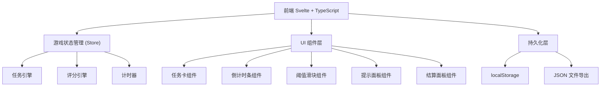
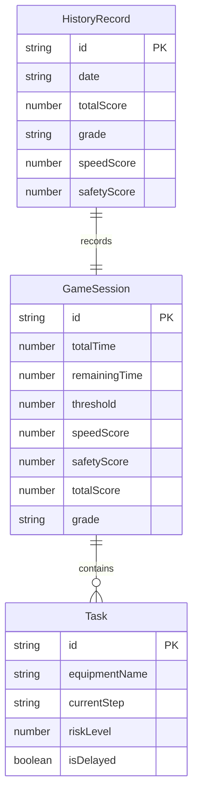

## 1. 架构设计



## 2. 技术说明

- 前端：Svelte@5 + TypeScript + Vite
- 初始化工具：Vite (svelte-ts template)
- 后端：无
- 数据库：无（使用 localStorage + JSON 导出）
- 样式：Tailwind CSS

## 3. 路由定义

| 路由 | 用途 |
|------|------|
| / | 游戏主界面（含开始界面） |
| /game | 游戏进行中界面 |
| /result | 结算面板 |

## 4. API 定义

无后端 API，所有数据在前端处理。

## 5. 服务器架构

无服务器架构。

## 6. 数据模型

### 6.1 数据模型定义



### 6.2 数据定义

```typescript
type Step = 'clean' | 'review' | 'shelve'

interface Task {
  id: string
  equipmentName: string
  currentStep: Step
  riskLevel: number
  isDelayed: boolean
}

interface GameSession {
  id: string
  totalTime: number
  remainingTime: number
  threshold: number
  speedScore: number
  safetyScore: number
  totalScore: number
  grade: string
  tasks: Task[]
}

interface HistoryRecord {
  id: string
  date: string
  totalScore: number
  grade: string
  speedScore: number
  safetyScore: number
}
```
